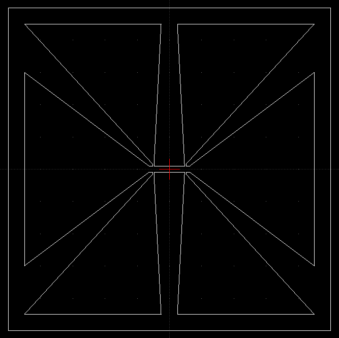

# DXFmaker
created by Justin Michel (michel.169@osu.edu)
Use this CLI to quickly create basic Hall bars of chosen dimensions.
## Installation
Just download the folder, or if you have git use:
```
git clone https://github.com/YangLabOSU/DXFmaker
```
The HBTemplate.dxf file is needed to create new files, so do not delete/edit it.

## Example usage
In a terminal, navigate to the DXFmaker folder, and do
```
python .\DXFmakerHB.py
```
Run this command with the -h flag for a list of options.
Here they are for easy reference:
```
-> python .\DXFmakerHB.py -h
usage: Command Line DXF Hall Bar maker [-h] [-f DESTINATION_FILE_NAME] [-b BOUNDING_BOX_SIZE] [-g GAP_SIZE] [-w MAIN_CHANNEL_WIDTH]
                                       [-l MAIN_CHANNEL_LENGTH] [-wv V_CHANNEL_WIDTH] [-lv V_CHANNEL_LENGTH]
                                       [-lg GAP_AFTER_V_CHANNEL]

Makes simple Hall bar dxf files with given dimensions. All units are in microns.

options:
  -h, --help            show this help message and exit
  -f DESTINATION_FILE_NAME, --destination_file_name DESTINATION_FILE_NAME
                        Output file name. Do not include a file extension. Default is "./DXFmakerHallBar"
  -b BOUNDING_BOX_SIZE, --bounding_box_size BOUNDING_BOX_SIZE
                        Size of the bounding box that surrounds the Hall bar. This also affects the pad size as the pad edges will    
                        be a specified distance from the bounding box edge.
  -g GAP_SIZE, --gap_size GAP_SIZE
                        Size of the gap between the pad edges and the bounding box.
  -w MAIN_CHANNEL_WIDTH, --main_channel_width MAIN_CHANNEL_WIDTH
                        Width of the Hall bar.
  -l MAIN_CHANNEL_LENGTH, --main_channel_length MAIN_CHANNEL_LENGTH
                        Center-to-center distance between voltage leads.
  -wv V_CHANNEL_WIDTH, --V_channel_width V_CHANNEL_WIDTH
                        Voltage lead width.
  -lv V_CHANNEL_LENGTH, --V_channel_length V_CHANNEL_LENGTH
                        Voltage lead length before fanning out to pads.
  -lg GAP_AFTER_V_CHANNEL, --gap_after_V_channel GAP_AFTER_V_CHANNEL
                        Gap between edge of voltage leads and beginning of fanning out of the main channel to current pad.
```

So if you want a 20um x 100um Hall bar with 5um wide voltage leads in a 1mm^2 area, simply do:
```
python .\DXFmakerHB.py -w 20 -l 100 -wv 5 -b 1000
```

The result then looks like this:



When you convert the file in the laser writer, make sure to turn on the XOR option, as this will correctly expose the area between the bounding box and the Hall bar for etching. If you plan to use liftoff, simply delete the bounding box.